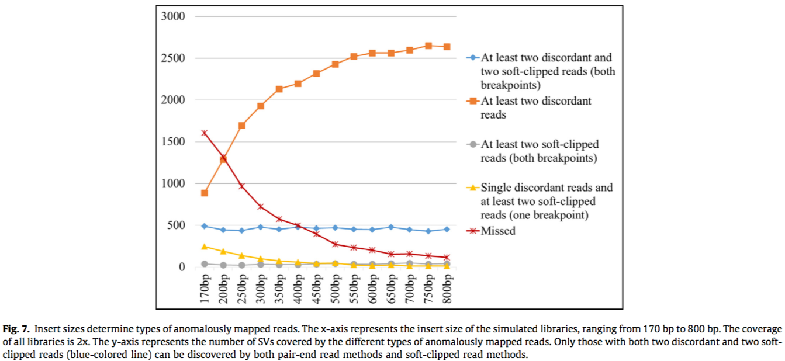

## Structural variation detection using next-generation sequencing data A comparative technical review

2. The SV calling pipeline
2.1. Data preprocessing
2.1.1. Reads mapping
+ mapped concordantly (i.e. the two reads are mapped in correct orientation, correct strand and the distance between them is consistent with the insert size distribution)
+ (1) soft-clipped (i.e. partially mapped), (2) one-end-anchored (i.e. one of the read in the paired read is unmapped) or (3) mapped discordantly.
2.1.2. Reads filtering
However, such filtering method may potentially remove SV signals because the SV- containing reads are often partially mapped, leading to lower map- ping scores.Reads mapped to repetitive regions, which are hotspots for SVs, may also have lower MAPQs because of similar secondary alignments. Such upstream filtering inevitably impacts the sensitiv- ity of the pipeline.
2.1.3. Reads classification
Mapping-based SV callers mainly infer SVs from three types of anomalously mapped reads, namely, 
(1) discordant reads (mapped either on different chromosome (signal for translocations or transpositions, Fig. 1F), incorrect strands (signal for inversions, Fig. 1E), incorrect orientation (signal for duplications, Fig. 1C and D) or incorrect insert size (signal for insertions and deletions, Fig. 1A and B)), 
(2) soft-clipped reads (signal for the breakpoint, mapped partially) or 
(3) one-end-anchored reads (sig- nal for the breakpoint, unmapped reads whose mates are mapped).

 the various SV discovery techniques: cluster- ing, split-reads alignment, contig (consensus sequence) assembly and statistical testing.

  The soft-clipped and one-end anchored reads can be aligned to the SV breakpoint regions to refine the position of the breakpoints up to base-pair resolution (Fig. 1).
2.2. SV discovery
2.2.1. Direct vs. indirect cases
Here, we classify the anoma- lously mapped reads that support an SV into two cases: direct case and indirect case.
Read-depth feature can only detect unbalanced SVs. However, read-depth changes at the boundary of balanced SVs can also be used to better annotate the balanced SVs. 
2.2.2. SV discovery techniques
2.2.3. Hybrid-approach for SV discovery
2.3. SV verification
2.4. SV annotation
2.5. SV visualization
3.2. Library properties impact SV calling
 Those properties include coverage (i.e. sequencing depth), insert size and read length of the paired reads
it might be beneficial to integrate paired reads of different insert sizes to call SVs. Biologist may also consider optimizing the library properties to suit the SV callers chosen

Libraries with smaller insert size tend to have more soft-clipped reads mapped.

With increased insert sizes, the number of SVs covered by at least two soft-clipped reads is reduc- ing (blue + grey); but the number of SVs covered by at least two discordant reads is increasing (blue + orange). Only 15% of the sim- ulated SVs are tandem duplications. However, 65% to 75% of the SVs with ‘‘at least two discordant and two soft-clipped reads” are tandem duplications, which have more reads support because of the increased copy numbers.
