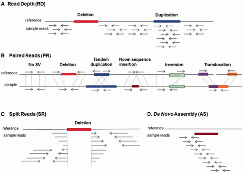

Most 1000 Genomes SVs are deletions because these are easier to detect in low coverage sequencing data.[https://www.nature.com/articles/nature15394]

https://www.ncbi.nlm.nih.gov/pmc/articles/PMC5382922/

BND即breakend的缩写。在CHROM、POS中展示第一个断点位置，在ALT中展示第二个断点位置，例如：A]10:115172011]、[12:70547434[C。通过比较第一个断点和第二个断点的染色体，可以判断是染色体间易位还是染色体内易位（这里为了描述方便，使用了“第一个断点”、“第二个断点”的描述方式，事实上两个断点并没有顺序之分）。
值得注意的是，ALT中方括号的方向在判断融合基因中有重要的作用。...]...]指易位序列在第一个断点位置的3'端，[...[...指易位序列在第一个断点位置的5‘端

https://zhuanlan.zhihu.com/p/87408242

## 插入片段
Differences	between	insert	size	and	inferred	insert	size*
can	be	used	to	detect	evidence	of	structural	variants,	
including
• Deletions
• Insertions
• Inter-chromosomal	rearrangements
Interpreting inferred insert size
*	or	template	length	and	observed	template	length

+ 串联重复（Tandem Duplicate）
+ 易位（Translocation）
+ deletions
+ 倒置 (Inversions)

## 过滤
1. raw counts of paired and split reads supporting each allele.  The split read counts will not always be available because some calls will be imprecise, so the paired read count (SAMPLE/PR), might be the best starting point.

