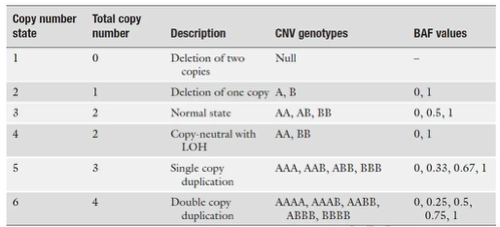

https://rdrr.io/category/biocview/CopyNumberVariation/

## 历史
Technologies for CNV Detection
+ Giemsa staining
+ Fluorescent in situ hybridization (FISH) - 荧光原位杂交
+ Comparative genomic hybridization (CGH) - 比较基因组杂交
+ Spectral karyotyping (SKY)
+ SNP genotyping arrays

## 名词
### LRR
> **LRR** is a measure of normalized total signal intensity.
> **BAF** is a measure of normalized allelic intensity ratio.
```
BAF = Y / (X + Y)
LRR = log2( (X + Y)sampleOfInterest / (X+Y)baselineSample)
```
The combination of LRR and BAF can be used together to determine different copy numbers and to differentiate copy-neutral LOH regions from normal copy regions.



