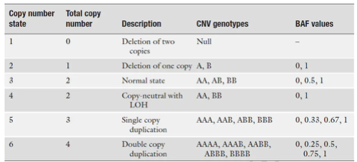

https://rdrr.io/category/biocview/CopyNumberVariation/

# 历史背景
Technologies for CNV Detection
+ Giemsa staining
+ Fluorescent in situ hybridization (FISH) - 荧光原位杂交
+ Comparative genomic hybridization (CGH) - 比较基因组杂交
  它能产生全基因组中染色体上DNA序列拷贝数图谱，使用两种不同的荧光将癌症组织样本和正常组织样本的DNA进行标记制成探针后，再同时与正常的分裂中期染色体进行杂交，通过检测染色体上不同区域的两种荧光的强度比，来发现DNA序列扩增或者丢失的区域。CGH技术具有：使用DNA样本量少，检测基因组拷贝数变化只需一次杂交，既能对活细胞或组织也能对存档组织进行研究的优点。但是，它所能检测到的DNA序列扩增或丢失的大小为3-5Mb，因此对于低水平的DNA扩增和小片段丢失，会发生漏检。
+ array CGH，aCGH - 微阵列比较基因组杂交技术[10]。
  与CGH技术相比，aCGH使用微阵列代替CGH技术中的中期分裂相的染色体，使用带有不同荧光标记的测试DNA探针，以DNA探针为模板，竞争性地与微阵列的靶序列进行杂交。与CGH技术相比，它具有两方面的明显优势：（1）灵敏度和准确性较高。染色体上DNA以高密集度和超螺旋的形式存在，而aCGH技术避开了复杂的染色体结构，所使用的靶序列为少数基因的DNA片段。因此与CGH技术相比，aCGH技术能找出那些无法检测出的拷贝数差异，而且能对扩增或缺失的位置进行精准地定位。（2）自动化和程序化。aCGH技术与普通的基因芯片检测表达谱的流程一样，可以使用机器和计算机自动操作，快速且省时省力。
+ 单核苷酸多态性微阵列技术 （single nucleotide polymorphism arrays，SNP arrays）[11]。
  它通过检测杂合性丢失（loss of heterozygosity，LOH）来检测基因组片段的扩增和缺失。
+ 深度测序技术[12]。
  使用深度测序技术产生的数据来检测拷贝数变异是近年来飞速发展的新领域。拷贝数变异检测的精确度和分辨率随着测序深度的增加而提高，可以获得更加准确的拷贝数变异的断点位置，并且能够检测基于芯片方法所不能检测的插入和倒位等基因组变异形式。由于深度测序技术不需要探针，能以单碱基分辨率在全基因组范围内检测拷贝数变异，因而可以显著提高拷贝数变异的检出数。
+ Spectral karyotyping (SKY)
+ SNP genotyping arrays

# 名词
## LRR
> **LRR** is a measure of normalized total signal intensity.
> **BAF** is a measure of normalized allelic intensity ratio.
```
BAF = Y / (X + Y)
LRR = log2( (X + Y)sampleOfInterest / (X+Y)baselineSample)
```
The combination of LRR and BAF can be used together to determine different copy numbers and to differentiate copy-neutral LOH regions from normal copy regions.




# 算法
## segmentation
### segmentation algorithms
1) The univariate method, which considers only one sample at a time, is ideal for detecting rare and/or large CNVs. 
2) The multivariate method, which simultaneously considers all subjects, is ideal for detecting small, common CNVs. Some CNV detection algorithms also assign actual copy number calls (0,1,2,3…) for a segment based on thresholds of LR segment means, though there are some reasons why this is problematic (see CNV Analysis Tips for Illumina Data).


---


<!-- TOC -->
auto- [对于cnv分析的几点思考：](#对于cnv分析的几点思考)
auto        - [过滤](#过滤)
auto        - [鉴定断裂点](#鉴定断裂点)
auto- [肿瘤拷贝数数据中的异方差校正](#肿瘤拷贝数数据中的异方差校正)
auto- [Aneuploidy非整倍体](#aneuploidy非整倍体)autoauto
<!-- /TOC -->


+ Copy number alterations/aberrations (CNAs)
+ copy number variations (CNVs) 

+ Comprise  copy-number variations ≥ 50 bp, including deletions, insertions and duplications, as well as balanced variants such as inversions and translocations.

+ Recurrent structural variants often result from non-allelic homologous recombination (NAHR) which involves recombination between long highly similar low-copy-number repeats.非等位基因同源重组是同源重组的一种形式，其发生在具有高序列相似性但不是等位基因的两段DNA之间。 它通常发生在先前通过进化复制的DNA序列之间，因此具有低拷贝重复。这些重复元件的长度通常为10-300kb，并且具有95-97％的序列同一性。在减数分裂或有丝分裂期间，LCR可能不对准，随后的交叉可导致遗传重排。

## 对于cnv分析的几点思考：
#### 过滤
“Unfiltered” refers to all CNVs ≥1 kb, while “filtered” refers to CNVs that had <70% overlap with repetitive and low-complexity regions of the genome.

#### 鉴定断裂点
+ CNVkit uses off-target reads between genes to detect CNV breakpoints, if your targeted sequencing protocol uses hybrid capture. In most of your cases this should help place the breakpoint correctly in the intergenic region instead of at the edge of the next targeted exon. Otherwise the CNVkit pipeline is conceptually similar to the workflow you're probably using.
+ If your protocol is targeted amplicon sequencing instead, and there are no off-target sequencing reads to improve your estimates, then try OncoCNV. After running CBS via DNAcopy, it uses another statistical test at the gene level to remove spurious breakpoints. I think this might trim the CNV to the gene of interest in your problematic cases.
+ The R package PSCBS, which wraps DNAcopy, has a procedure for estimating confidence intervals around breakpoints, which would help you detect breakpoints with questionable positioning near gene boundaries (if you don't mind some additional programming).

## 肿瘤拷贝数数据中的异方差校正
理想情况下，可以从整个基因组中均匀地采样DNA片段，但是Illumina测序仪倾向于具有非常高或很低GC含量的偏差。 GC含量是测序读段中G和C碱基对的数量。采样基因组中的其他偏差也可能发生。但是，通常通过对来自同一患者的配对正常组织样品进行测序来解决。然后，正常对照样本具有相同的偏倚，因此，当您计算肿瘤相对于正常对照的对数比时，偏倚就会抵消。但是，我之所以写这篇文章，是因为我有不幸的经验，无法消除那些偏见[2]。图2显示了引起的问题。它根据GC含量绘制log2（肿瘤/对照）。通常，这看起来很平坦，但是就GC含量而言，明显存在异方差，这是不希望的。为了更清楚地显示异方差，图3显示了0.005 GC含量的窗口中的方差估计。

DNA fragments would ideally be uniformly sampled from throughout the genome, but Illumina sequencing machines (for example) tend to have a bias with very high or low GC content. GC content is the number G and C basepairs in the sequenced read. Other biases in sampling the genome may also occur. However, this is usually dealt with by sequencing a paired normal tissue sample from the same patient. The normal control sample then has those same biases, so when you compute a log ratio of the tumor over normal control, the biases cancel out. However, the reason why I am writing this post is I had the unfortunate experience with having data where those biases did not cancel out [2]. Figure 2 shows the issue that caused. It plots the log2(tumor/control) against the GC content. Normally this would appear flat, but there is clear heteroskedasticity with respect to GC content, which was undesirable. To more clearly show the heteroskedasticity, Figure 3 shows the variance estimate in windows of 0.005 GC content.

https://murphycj.github.io/heteroskedasticity-correction/

## Aneuploidy非整倍体
It is not a CNV.
1. (45, X) - Turner syndrome.
2. In uniparental disomy, both copies of a chromosome
come from the same parent (with no contribution from
the other parent).
3. Trisomy 21, Trisomy 18, Trisomy 13 - Down, Edwards,
Patau. (47, XXX), (47, XXY), (47, XYY).
4. XXXX, XXYY, XXXXX, XXXXY and XYYYY.


https://ngschool.eu/sites/default/files/uploads/20160802/1.pdf


## General CNV analysis strategy
The analysis strategy for CNVs depends on inheritance mode and other factors.
These are examples of ananlysis steps that are commonly performed:

1. Check for compound heterozygous variants: CNV/CNV und CNV/SNV

Note: For the analysis of compound heterozygous CNV and SNVs, the filtering of the small variants is relevent: use the dominant_relaxed filter.

2. Check for homozygous deletions using the copy number=0 filter

3. Check for microdeletion syndromes using min regions=10 filter

4. Check for CNVs matching the patient phenotype (target region and/or phenotypes filter)

5. Check for CNVs in ACMG target-region


https://bioconductor.org/packages/release/bioc/html/CNVtools.html