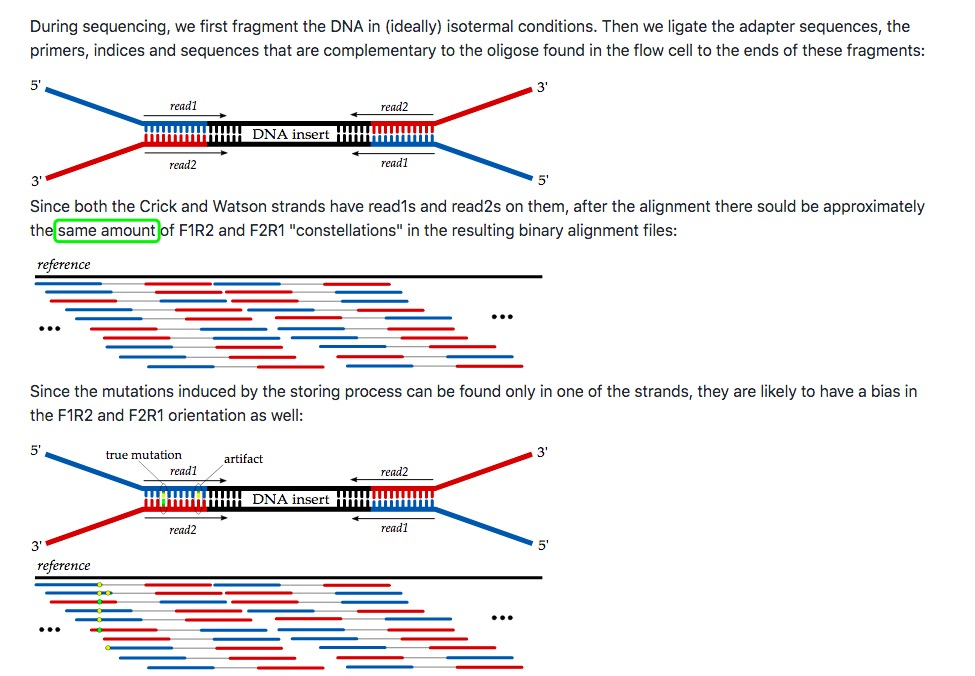

## 插入片段

## Pair Orientation vs. Strand Bias
> A pair that aligns with the expected relative mate orientation and with the expected range of distances between mates is said to align "concordantly". If both mates have unique alignments, but the alignments do not match paired-end expectations (i.e. the mates aren't in the expected relative orientation, or aren't within the expected distance range, or both), the pair is said to align "discordantly". 

> F1R2 means either (the read mapped to the forward strand and was read 1(first read) of the pair) or (the read mapped to the reverse strand and was read 2 of the pair). F1R2 means first read in the pair aligns to the forward strand, second reverse, etc.

> F2R1 means the first read (i.e. leftmost read when aligned) is the second in pair and aligns to forward strand, etc

## Mate-Pair and Paired-End
+ Mate-Pair is a library construction method. 
+ Paired-End is a method of sequencing. 

The confusion arises from Pyro/454/Roche terminology wherein they used the term "mate-pair" to describe what Illumina now calls "paired-end" sequencing. The distinction was made (by Illumina) when the technique of constructing "MATE-PAIR" libraries was introduced and when Illumina introduced sequencing from both ends "PAIRED-END".

+ igv中说明：https://software.broadinstitute.org/software/igv/interpreting_pair_orientations
+ 参考     ：http://www.cureffi.org/2012/12/19/forward-and-reverse-reads-in-paired-end-sequencing/
+ https://www.biostars.org/p/344264/
+ 