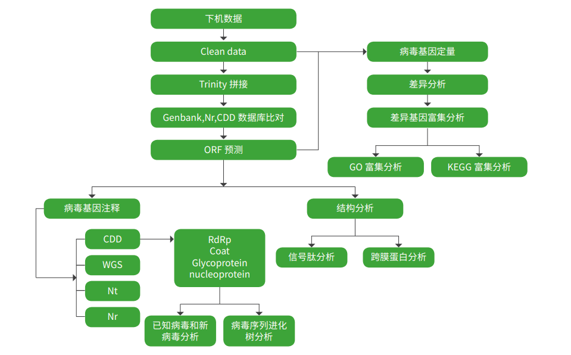

https://www.cd-genomics.com/bioinformatics-analysis-of-viral-metagenomic-sequencing.html

https://talk.ictvonline.org/

下机数据进行质控，得到有效数据（Clean Data）。然后基于有效数据进行 Trinity 拼接、rsem 定量分析，后续
进行的 ORF 预测与结构分析，以及 Nr、Nt，WGS 和 CDD 数据库的注释，全面了解样品中的病毒组成注释信息，并
可以发现已知或新病毒的 ORF 信息。在 CDD 的注释结果中，我们还可以得到病毒的 RdRp、Glycoprotein、coat 和
nucleoprotein 相关的结果，从而更加深入的了解到样本中病毒的信息。通过对保守区域的序列进行进化树分析，有助于
理解不同病毒序列之间的系统发育关系。

通过对 RNA 病毒基因组的结构预测，获得 RNA 病毒蛋白保守结构域，与近缘的病毒基因组进行同源性分析，确
定不同病毒间的结构差异。为后续深入的机制探究提供数据支持。通过对保守结构域 RdRp（RNA-dependent RNA
polymerase）进行系统发育进化树分析，通过 RdRp 结构上的差异，可发现新的病毒进化分支，并根据其近缘的病毒推
测其可能的作用和发挥的功能。