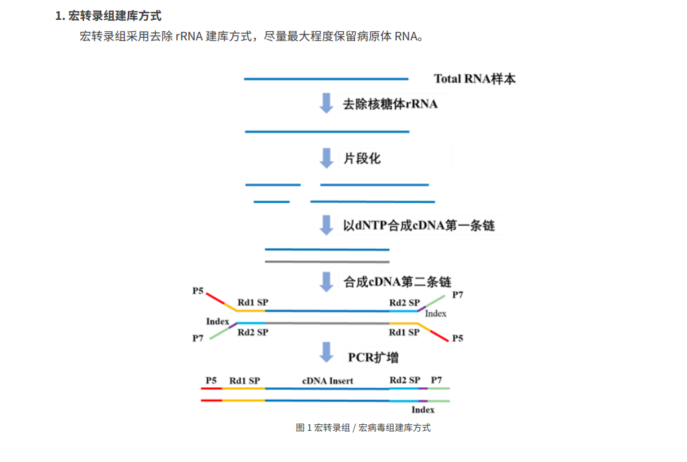

首先要对原始数据进行预处理，得到有效数据（Clean Data）。然后基于有效数据进行物种分类分析和复杂度分析
以及基因的表达丰度分析；再进行拼接与组装，进行代谢通路（KEGG），同源基因簇（eggNOG），碳水化合物酶（CAZy）
等功能注释，全面了解样品中的微生物组成结构和功能注释信息。最后，基于以上分析结果，可以进行多样品比较分析，
如聚类分析，PCoA 分析等，挖掘出样品之间的物种和功能差异。

使用 DIAMOND 软件将拼接后的 Unigenes 与从 NCBI 的 NR 数据库中抽提出的细菌（Bacteria）、真菌（Fungi）、
古菌（Archaea）和病毒（Viruses）序列进行比对，选取出在各样品中的最大相对丰度排名前 10 的物种，通过物种丰度
统计明确主要占比的微生物种类。

为获得全面的基因功能信息，进行了四大数据库的基因功能注释，包括：GO、KEGG、CAZy 和 eggNOG。统计不同
功能层级的相对丰度，确定微生物在特定环境中发挥的主要功能。