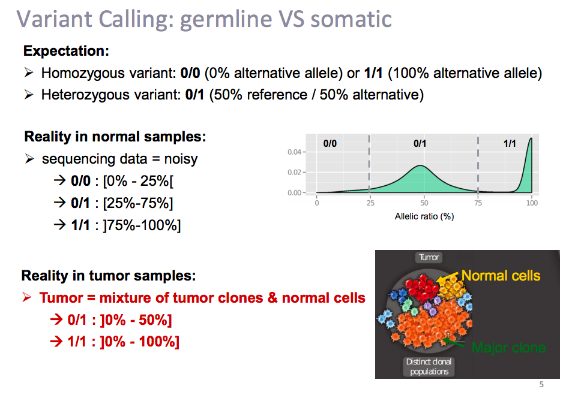

002_CoverageCalculatorPy https://github.com/AWGL/CoverageCalculatorPy

https://byteofbio.com/archives/7.html

https://byteofbio.com/archives/14.html

## 【染色体非整倍性】
早期染色体不稳定（CIN）是随机出现的，有稳定的克隆性改变（clonal chromosomal alterations. CCA）和不稳定的非克隆性改变（NCCA）两种形式 ，NCCA是结构CIN和癌症演化的主要标志。

CIN中的拷贝数变异（numerical CIN ，CNV），或称染色体非整倍性或称染色体畸变（aneuploidy）。除整条染色体拷贝数的变化外，染色体非整倍性还包括了染色体臂的扩增或缺失。需要注意，全染色体错误分离的机制与引起臂水平拷贝数变化的机制有很大不同。染色体非整倍性可通过增加遗传异质性，促进肿瘤发生。研究表明，非整倍性是一种与环境有关的、特定于癌症类型的致癌事件，可作为具有临床意义的预后指标和潜在治疗靶标。

## 资源

[肿瘤分类](http://oncotree.mskcc.org/#/home)