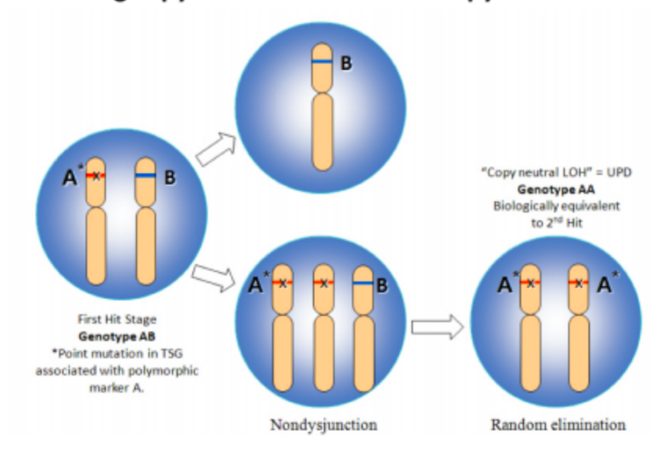

# LOH

LOH, loss of heterozygosity

One inherited dysfunctional TSG is not oncogenic. The 2nd wild type allele must go. 

**LOH**: Usually the 2nd wild type allele is deleted and now only one dysfunctional gene exist. This refers to loss of heterozygosity. 

**cnLOH(copy neutral LOH)**: Sometimes, the second wild type allele is lost and the dysfunctional one duplicates. Two dysfunctional are oncogenic.This is called copy neutral loss of heterozygosity. 

Once in a while a phenomenon of gene conversion somewhat like homologous recombination leads to the wild type allele being converted into dysfunctional gene. This too is copy number neutral LOH. Epigenetic silencing of the wild allele has same functional effect as of biallelic gene loss but is not called LOH because it is not amenable to detection by methods employed to detect LOH.

LOH, in its broadest sense, simply says that a locus for which a cell is heterozygous, meaning that the 2 parental alleles are distinguishable, becomes homozygous. This is often seen in cancer, where a locus that is heterozygous in a normal cell becomes homozygous in a cancer cell derived from this normal cell. The important issue is how does this happen and what does it mean. By far, the most frequent mechanism is a cell cycle error where a chromosome (let us say it is the paternal allele) gets duplicated as a result of this error, leading to transient triploidy, followed by loss of one of the 3 chromosomes. If the chromosome that gets lost is not the one that was duplicated (i.e.: the maternal allele), then you get loss of that allele resulting in loss of heterozygosity. An important point is that there is no net loss of DNA in that process. One parental allele is lost, but the other is duplicated so you end up with a pair of 2 chromosomes, which is what you started with. Other mechanisms include deletions or other chromosome rearrangements, but the one that I explained above is the most important, as evidenced by the fact that loss of heterozygosity is usually not associated with loss of any genetic material. This is an important mechanism of tumor suppressor gene inactivation, as it represents the second hit in Knudsen's two-hit hypothesis for tumor suppressor inactivation.

sporadic cancer
hereditary cancer

uniparental disomy (UPD)

https://bitbucket.org/mcgranahanlab/loh

