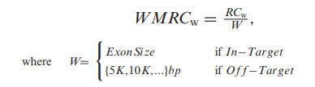

excavator2在计算测序深度时将reads分为了以下两个部分:
+ in-target reads
+ off-target reads

in-target表示的是位于exon上的序列，off-target表示的是位于基因间区或者内含子区的序列，同样采用了滑动窗口的方式来统计每个区域的测序深度，简称WMRC, 计算公式如下:

单个外显子直接作为一个窗口，而非外显子区域则采用了一个固定长度的窗口，分开统计不同区域的测序深度，并进行校正，校正的时候考虑了GC含量，不同区域的mappability, 外显子的大小等因素。

利用归一化之后的测序深度，计算对照样本和实验样本的log2 ratio值，然后采用HSLM segmentation算法划分segment, 最后通过FastCall算法预测每个segment的拷贝数情况。