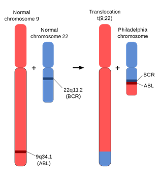

## chimeraviz
https://github.com/stianlagstad/chimeraviz

https://github.com/FusionAnnotator

https://fusionhub.persistent.co.in/

## benchmark
https://github.com/fusiontranscripts/FusionBenchmarking/wiki

### Simulated Fusion Data Sets
Simulated chimeric transcripts were generated using custom scripts, developed and released as the Fusion Simulator Toolkit (https://FusionSimulatorToolkit.github.io).

https://data.broadinstitute.org/Trinity/CTAT_FUSIONTRANS_BENCHMARKING/

### Simulated Reads

## Question: Why is RNA-Seq or cDNA used to detect gene fusions instead of gDNA?
https://www.biostars.org/p/101309/#101311

# 经典融合基因
## 什么是BCR-ABL阳性？
在22号染色体短臂可能发生染色体易位，导致致癌的基因融合产物BCR-ABL. 这个基因将会编码BCR-ABL融合蛋白。根据融合位点的不同，融合蛋白的质量可能从185到210 kDa不等。

ABL基因表达一种细胞膜功能相关的蛋白，酪氨酸激酶。酪氨酸激酶的活性带有自我抑制机制，但融合后的BCR-Abl蛋白则失去了这种抑制机制，处于持续激活的状态，将会导致DNA binding功能受损，并引起无法控制的细胞增殖。

## 
### readthrough transcription
http://www.ensembl.info/2019/02/11/annotating-readthrough-transcription-in-ensembl/
https://www.ncbi.nlm.nih.gov/pmc/articles/PMC5793191/
https://www.researchgate.net/publication/263098042_Recurrent_read-through_fusion_transcripts_in_breast_cancer
https://pdfs.semanticscholar.org/1ed5/4ef860e599ca2113fe3ba5a7118c6ef120d8.pdf

https://www.stjuderesearch.org/site/lab/zhang/cicero#