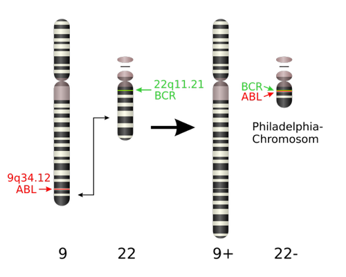

## 费城染色体
费城染色体（Philadelphia chromosome, Ph (or Ph') chromosome），或称费城染色体易位（Philadelphia translocation），是一种与慢性粒细胞性白血病（chronic myelogenous leukemia, CML）相关的特殊染色体易位现象。其中细胞的9号染色体长臂与22号染色体长臂进行相互易位，具体定义为t(9;22)(q34;q11)。这一染色体易位现象与慢性粒细胞性白血病有高度的灵敏度，有95%的慢性粒细胞性白血病患者被检测有此染色体易位（剩余的人群则是或存在一种G显带染色体制备过程中的隐形易位，或是存在其他多变的染色体易位情况）。但是，其对诊断是否为慢性粒细胞性白血病没有足够高的特异度，因为此染色体变异亦发现于急性白血病中（大约20-30%的成人与2-10%的未成年患者案例）以及个别的急性骨髓性白血病案例。

染色体易位是费城染色体中染色体缺失的主要原因。在九号染色体中长链的Abl基因（位置q34）与二十二号染色体上长链的BCR基因（位置q11）发生并列性易位而产生一种新的融合基因（fusion gene）[7]。根据国际人类细胞遗传学术语命名法（英语：International System for Human Cytogenetic Nomenclature），这种染色体易位被称为“t(9;22)(q34;q11)”。

这种易位产生了一种致癌的BCR-ABL融合基因，位于因此变短的22号染色体的长链上。此基因产生出一种Bcr-abl融合蛋白（Bcr-abl fusion protein）。因为该融合基因的分子重量为185至210kDa，其也被称为p210或p185。因为Abl基因释放一种膜相关的蛋白、酪氨酸激酶，所以BCR-Abl基因也被酪氨酸激酶传输，并加载一组磷酸盐到此酪氨酸中。尽管BCR基因亦释放丝氨酸/苏氨酸激酶，但酪氨酸激酶作用则与药物治疗非常相关。所以酪氨酸激酶抑制剂（比如伊马替尼和舒尼替尼）都是一些重要的针对各种白血病的药物。该融合基因形成于慢性粒细胞性白血病的前期，通常在急性骨髓性白血病中亦呈阳性。

此BCR-ABL融合基因亦和白介素-3受体（interleukin-3 receptor）基座发生相互反应。BCR-ABL融合基因的复制是呈自我组合型，即其形成并不需要其他细胞信息性蛋白质的参与。同时，BCR-Abl基因却激活以及控制大量蛋白质与酶，加速细胞的分裂。此外，其还抑制DNA修复，引起基因组不稳定性，并根本上影响慢性粒细胞性白血病患者的机体恶化。

## BCR ABL 基因检测
慢性髓系白血病(chronic myeloid leukemia, CML，也称为慢性髓细胞白血病或慢性粒细胞白血病)是一种骨髓增殖性肿瘤，表现为成熟和未成熟的粒细胞失调控的生成和不受控制的增殖，细胞分化大体正常。(参见“骨髓增生性肿瘤概述”)
CML与2个基因的融合有关：BCR(在22号染色体上)和ABL1(在9号染色体上)形成BCR-ABL1融合基因，表现为22号染色体长臂区段易位至9号染色体长臂上。这种异常融合通常是由于9号染色体和22号染色体相互易位，即t(9;22)(q34;q11)，产生一种异常的22号染色体，称为费城(Ph)染色体，含BCR-ABL1融合基因。

BCR-ABL1融合基因可以产生一种独特产物—BCR-ABL1融合蛋白。该蛋白产物包含一个来自正常ABL1的酶促结构域，具有酪氨酸激酶催化活性；相对于正常ABL1的激酶活性受到严格调控[1]，由于与BCR部分融合，BCR-ABL1的激酶活性增高且呈组成型表达[2]。这种失调控的酪氨酸激酶参与了CML的发病机制。(参见“慢性髓系白血病的分子遗传学”)

CML的临床特征为失调控地生成成熟和未成熟的粒细胞，主要是中性粒细胞，也包括嗜碱性和嗜酸性粒细胞。如果不予治疗，CML会呈三期或两期临床病程，从慢性期进展到加速期，并继续进展至终末急变期；有时直接从慢性期进展到急变期，尤其是急淋变时。

本文将总结CML的临床表现和诊断，其分子遗传学、生物学及治疗参见其他专题。(参见“慢性髓系白血病的分子遗传学”和“慢性髓系白血病的细胞和分子生物学”和“慢性髓系白血病治疗概述”)
####
https://www.uptodate.com/contents/zh-Hans/clinical-manifestations-and-diagnosis-of-chronic-myeloid-leukemia/print
