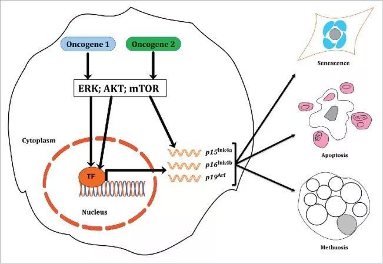

肿瘤的发生可以看做是体细胞变异累计的结果，按照所有的变异都正向驱动肿瘤发展的假设，患者包含的体细胞变异越多，其肿瘤发展会越快，然而从基因组测序的结果来看，驱动突变的基因通常是相互排斥的，也就是说如果两个驱动突变的基因同时发生，肿瘤的发展反而会被抑制 ，只出现一个时，则驱动肿瘤的发展。

与**互斥模式**相反，驱动基因间也会存在**协同模式**，两个协同的驱动突变往往同时发生，共同促进肿瘤的发展，

按照协同和互斥的作用模式，将突变分为以下两类
+ co-occurencing mutations
+ mutually exclusive mutations

oncogene1和oncogene2两个驱动基因同时表达， 过度激活ERK通路， 其靶蛋白的过量表达，诱导细胞的衰老和死亡，从而抑制肿瘤发展进程。

不同类型的肿瘤并不会共享某种驱动基因，驱动基因的突变往往只在某种特定肿瘤或者其亚型中表达。在进行互斥性分析时，最经典的分析方法是费舍尔精确检验。