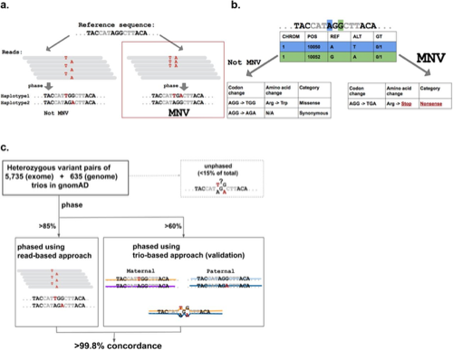

##

## 单倍型 分型  
单倍型这一概念，是对现有测序方法在空间层面上的一种补充。现有的测序方法，如二代、三代测序，虽然在碱基层面上达到了极高的精密度，但是却丢失了基因组在细胞内的空间分布信息，因为DNA经过打断这一过程，已无法追溯它的起源。而单倍型的概念，便是对于这一缺陷的补充，即试图分辨出，基因序列究竟来源于哪里。对于人类胚系细胞来说，当然这个来源只有两种可能：父系、母系；而在肿瘤的研究当中，由于肿瘤异质性以及 非整倍体 的存在，并非所有细胞的基因组都完全一致，因此不同单倍型可能来自于不同的亚克隆之中。

而如何判断碱基序列来源于同一个单倍型，这一过程就被称之为 phasing，因此可以说，phasing问题是整个单倍型的发现、MNV的判断的基础。

## MNV分类

https://bioitland.com/2020/04/28/Multi-nucleotide-variants/